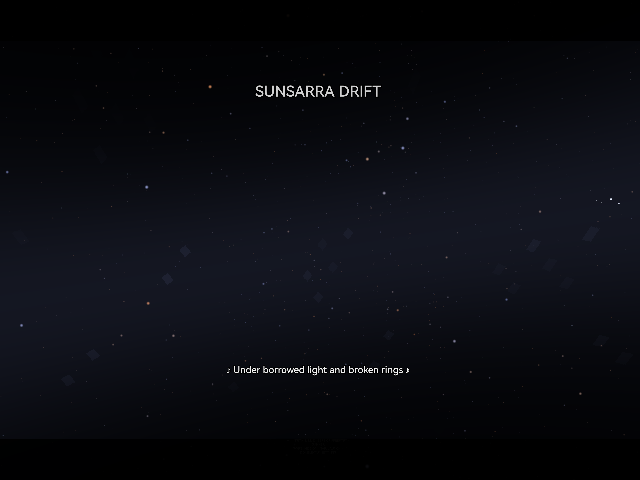
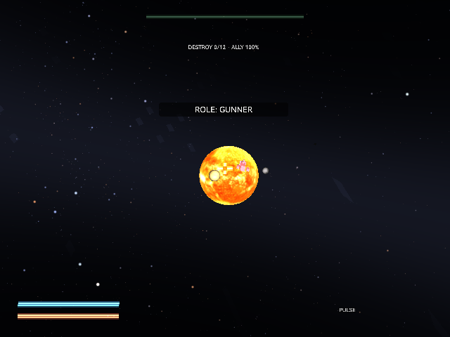

# SUNSARRA DRIFT

Sunsarra Drift is a first-person spaceship shooter for RayNeo X3 Pro AR glasses, built on the galaxy-rendering engine from Project Pale Blue — the same planets, HYG starfield, dust fields, and rail-based flight. Twelve missions retrace that project's tour of the solar system out to Sagittarius A*, each one an homage to a classic mission from film, print, tabletop games, or video games, as the crew hunts down the Confederate Empire, an interstellar faction of eugenicists who kidnapped the protagonist's mother. The crew mans three interchangeable seats — gunner, pilot, and engineer — each controlled entirely through head aim, a single tap, and a forward/back swipe, with progress, unlocks, and mission outcomes saved between sessions.

## Screenshots

  
  

## Controls

| Seat | Head | Tap | Swipe forward/back |
| --- | --- | --- | --- |
| Gunner | Aim reticle | Fire | Cycle Pulse / Missile (lock-on) / EMP |
| Pilot | Steer through gates | Boost | Throttle up / down |
| Engineer | Look at a station | Repair (3 taps) | Open/close fuel flow to allies |

Double-tap opens settings (restart, subtitles, volumes, invert steer, recenter, abandon).

## Download

[SunsarraDrift.apk](SunsarraDrift.apk)
